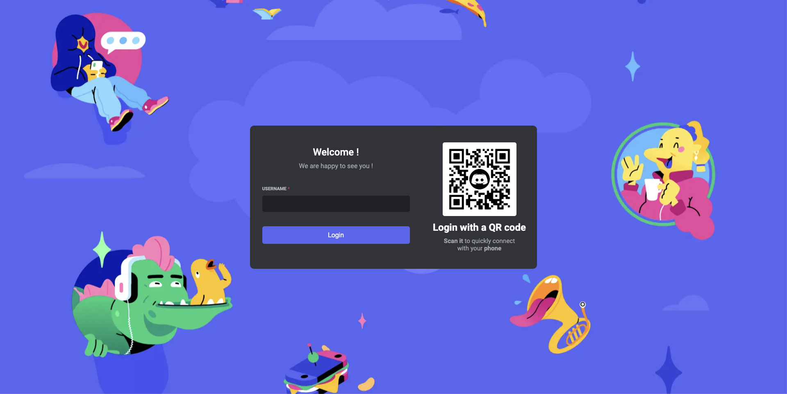
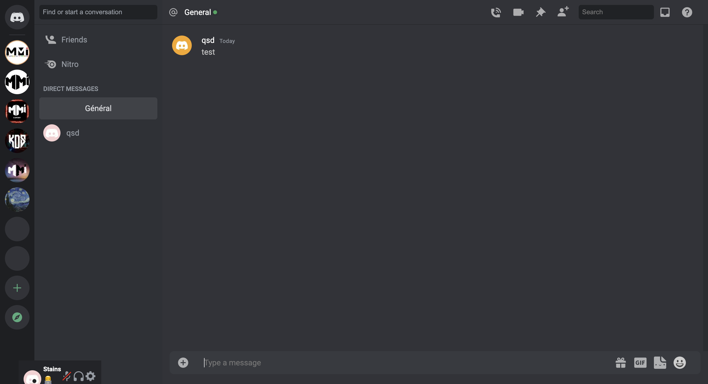

## Discord Chat with Next.js and Socket.io

Dans le cadre du module développement front en BUT MMI, j’ai dû réaliser un chat avec Next.js et [Socket.io](https://socket.io/). J'ai été complétement libre du choix du design et des nouvelles fonctionnalités. C'est pour cela que j'ai eu l'idée de créer un clone de [Discord](https://discord.com/) car, c'est une application que j'utilise au quotidien avec un design qui me plaît énormément, moderne avec beaucoup de micro-interactions.

First, run the development server:

## Links

[Live](https://chat-next-discord.vercel.app/login)

[GitHub](https://github.com/Valentin667/chat-next-discord-clone)

## Setup

Download [Node.js].(https://nodejs.org/en/download) Run this followed commands:

```bash
# Install dependencies (only the first time)
npm install

# Run the local server at localhost:8080
npm run dev

# Build for production in the dist/ directory
npm run build
```

Open [http://localhost:3000](http://localhost:3000) with your browser to see the result.




